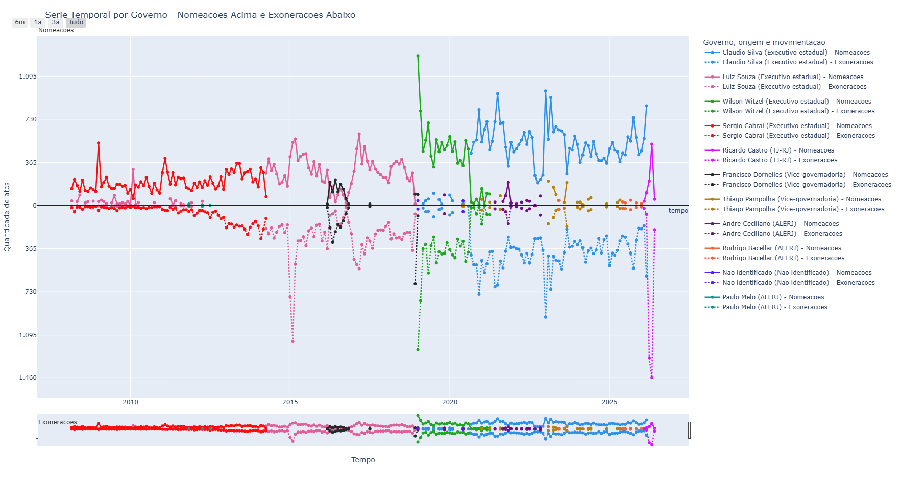
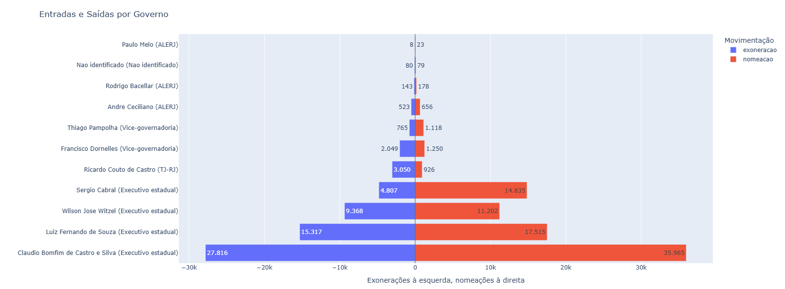
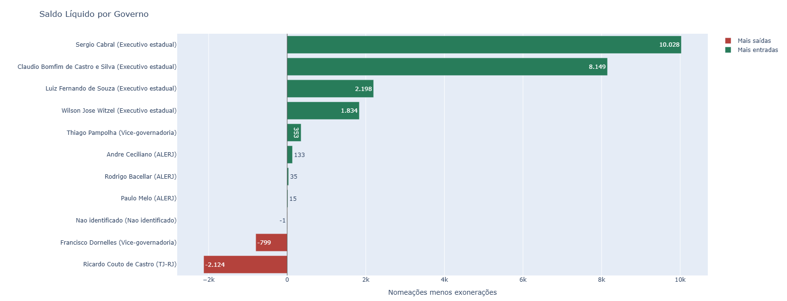
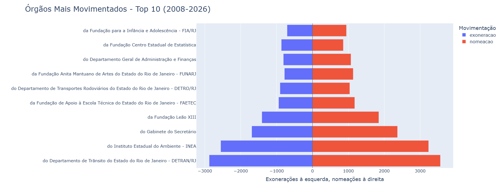
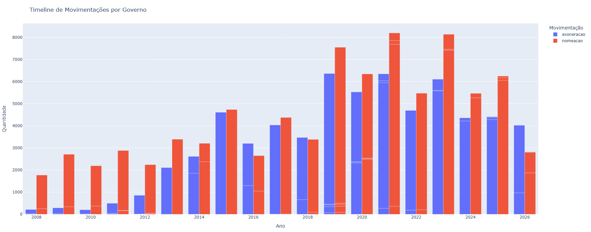
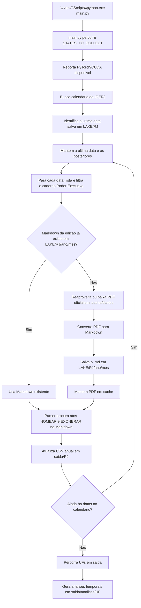

# Exoneracoes e nomeacoes nos diarios oficiais

Este projeto busca criar uma base historica de atos de exoneracao e nomeacao publicados em diarios oficiais brasileiros. A primeira etapa foca no Governo do Estado do Rio de Janeiro, acompanhando o Diario Oficial do Estado do Rio de Janeiro (DOERJ/IOERJ) da edicao online mais recente disponivel no portal atual para as mais antigas.

## Objetivos

- Converter as edicoes oficiais para Markdown com Docling e preservar somente o `.md` em `LAKE/UF`.
- Identificar atos de `NOMEAR` e `EXONERAR`.
- Catalogar data, caderno, nome da pessoa, tipo do ato, cargo, orgao, trecho e URL de origem.
- Produzir CSVs anuais auditaveis para analise jornalistica, historica e civica.
- Evoluir para outros estados mantendo a mesma estrutura de coleta e dados.

## Fonte inicial: Rio de Janeiro

A fonte inicial e o portal da Imprensa Oficial do Estado do Rio de Janeiro:

- Calendario de edicoes: <https://www.ioerj.com.br/portal/modules/conteudoonline/do_seleciona_data.php>
- O calendario online atual lista edicoes a partir de julho de 2005.
- O proprio portal informa atendimento separado para edicoes pre-2008, entao essas edicoes podem exigir outra estrategia de obtencao no futuro.

## Análise Exploratória das Movimentações

Além da construção da base estruturada de exonerações e nomeações extraídas do Diário Oficial, o projeto também incorpora uma etapa analítica para observar padrões temporais, diferenças entre representantes e intensidade das movimentações administrativas ao longo do tempo.

A análise considera dois tipos principais de movimentação:

- **Nomeações**: entradas de pessoas em cargos, funções ou posições públicas.
- **Exonerações**: saídas formais dessas posições.

A partir dessas informações, foram produzidos indicadores de volume total, saldo líquido e evolução temporal por representante.

---

### Série temporal por representante

A série temporal permite observar a evolução mensal das nomeações e exonerações associadas a cada representante político ou institucional.



O gráfico evidencia períodos de maior intensidade administrativa, especialmente em momentos de transição política, reorganização institucional ou mudança de gestão.  
As nomeações foram posicionadas acima do eixo central, enquanto as exonerações foram representadas abaixo, facilitando a leitura do fluxo de entrada e saída ao longo do tempo.

Esse tipo de visualização ajuda a identificar:

- picos concentrados de movimentação;
- períodos de substituição acelerada de pessoal;
- diferenças de padrão entre representantes;
- ciclos administrativos associados a mandatos ou mudanças de governo.

---

### Entradas e saídas por representante

O gráfico comparativo de barras mostra o total acumulado de exonerações e nomeações por representante.



A leitura acumulada mostra que os maiores volumes estão concentrados nos representantes vinculados ao Executivo estadual.  
<!-- README-DYNAMIC:REPRESENTANTES-START -->

Claudio Bomfim de Castro e Silva apresenta o maior volume total de atos, com **63.781 movimentações**, sendo **35.965 nomeações** e **27.816 exonerações**.

Luiz Fernando de Souza também apresenta volume expressivo, com **32.832 atos**, distribuídos entre **17.515 nomeações** e **15.317 exonerações**.

Representantes com menor período de atuação ou menor escopo institucional apresentam volumes mais reduzidos, como Wilson Jose Witzel, Sergio Cabral e Ricardo Couto de Castro.

<!-- README-DYNAMIC:REPRESENTANTES-END -->

---

### Saldo líquido de movimentações

O saldo líquido foi calculado pela diferença entre nomeações e exonerações:

```text
saldo = nomeações - exonerações
````



Esse indicador permite observar se determinado representante concentrou mais entradas ou mais saídas no período analisado.

Os resultados indicam:

<!-- README-DYNAMIC:SALDO-START -->

| Representante | Exonerações | Nomeações | Saldo | Total de atos |
| --- | ---: | ---: | ---: | ---: |
| Claudio Bomfim de Castro e Silva (Executivo estadual) | 27.816 | 35.965 | 8.149 | 63.781 |
| Luiz Fernando de Souza (Executivo estadual) | 15.317 | 17.515 | 2.198 | 32.832 |
| Wilson Jose Witzel (Executivo estadual) | 9.368 | 11.202 | 1.834 | 20.570 |
| Sergio Cabral (Executivo estadual) | 4.807 | 14.835 | 10.028 | 19.642 |
| Ricardo Couto de Castro (TJ-RJ) | 3.050 | 926 | -2.124 | 3.976 |

O maior saldo positivo aparece em **Sergio Cabral**, com **10.028 nomeações líquidas**.
Já **Ricardo Couto de Castro** apresenta saldo negativo, com **2.124 exonerações a mais do que nomeações**, indicando predominância de saídas no recorte analisado.

<!-- README-DYNAMIC:SALDO-END -->

---

### Órgãos mais movimentados

O ranking por órgão complementa a leitura por representante ao mostrar onde as movimentações se concentram administrativamente.



No recorte analisado, o maior volume aparece no **Departamento de Trânsito do Estado do Rio de Janeiro - DETRAN/RJ**, seguido pelo **Instituto Estadual do Ambiente - INEA**. O gráfico agrega variações de escrita do mesmo órgão, como diferenças de hífen, espaçamento e siglas, para evitar duplicidade artificial no ranking.

Essa visão ajuda a identificar:

* órgãos com maior rotatividade administrativa;
* estruturas que concentram nomeações e exonerações;
* diferenças entre volume bruto e saldo de entrada/saída;
* possíveis focos para auditorias ou análises específicas por órgão.

---

### Evolução anual das movimentações

A timeline anual permite observar como o volume de atos administrativos varia ao longo dos anos.



A distribuição anual mostra que os volumes de nomeações e exonerações não são homogêneos. Há anos com forte crescimento de movimentações, especialmente em períodos próximos a mudanças administrativas, reorganizações institucionais ou início de novos ciclos de gestão.

Essa análise é útil para identificar:

* anos de maior rotatividade administrativa;
* períodos de expansão ou recomposição de quadros;
* ciclos de entrada e saída de pessoal;
* possíveis rupturas associadas a mudanças políticas.

---

## Principais achados

A análise inicial aponta alguns padrões relevantes:

1. **Concentração no Executivo estadual**
   A maior parte das movimentações está concentrada nos representantes ligados ao Executivo estadual, especialmente Claudio Bomfim de Castro e Silva e Wilson Jose Witzel.

2. **Diferença entre volume e saldo**
   Um representante pode ter grande volume de atos sem necessariamente apresentar o maior saldo líquido. Por isso, a análise separa quantidade total, nomeações, exonerações e saldo.

3. **Rotatividade administrativa mensurável**
   A estrutura dos dados permite observar não apenas quantas pessoas entraram ou saíram, mas também quando esses movimentos ocorreram.

4. **Potencial para análises futuras**
   A base permite avançar para indicadores mais sofisticados, como:

   * taxa de reabsorção institucional;
   * tempo médio entre exoneração e nova nomeação;
   * redes de circulação entre cargos e órgãos;
   * análise de estabilidade administrativa;
   * detecção de ciclos de rotatividade;
   * rankings por órgão, cargo, ano e representante.

---

## Interpretação

O projeto mostra que dados públicos do Diário Oficial podem ser transformados em uma base analítica capaz de revelar padrões de movimentação administrativa.
Ao estruturar exonerações e nomeações em formato tabular, torna-se possível acompanhar ciclos de entrada e saída de pessoas no setor público, comparar representantes e construir indicadores de rotatividade institucional.

Essa abordagem contribui para ampliar a transparência, facilitar auditorias exploratórias e apoiar estudos sobre dinâmica administrativa no setor público.


## Como usar

Instale as dependencias:

```powershell
python -m pip install -r requirements-cuda.txt
python -m pip install -r requirements.txt
```

Rode o coletor:

```powershell
.\.venv\Scripts\python.exe main.py
```

Esse comando usa diretamente o Python da `.venv` do repositorio, mesmo que o ambiente virtual nao esteja ativado no terminal.

O `main.py` nao recebe argumentos. A coleta ativa executa somente `RJ`, definido em `STATES_TO_COLLECT`. O coletor identifica a ultima data ja armazenada em `LAKE/RJ` e retoma a partir dela, inclusive, para completar eventuais cadernos faltantes do ultimo dia antes de buscar datas novas. Os Markdown existentes sao reutilizados; quando precisa converter uma edicao ausente, o coletor reaproveita PDFs em `.cache/diarios` antes de baixar novamente. Se o `LAKE/RJ` estiver vazio, a coleta comeca no inicio do ano configurado em `RJ_COLLECTION_YEAR` (`2026`) em `diarios_oficiais/config.py`. A analise temporal fica no script separado em `analise_temporal/analisar_movimentacoes.py`.

O padrao dos arquivos Markdown e:

```text
LAKE/UF/ano/mes/<sigla>_<caderno>_<data>.md
```

Exemplo:

```text
LAKE/RJ/2026/04/DOERJ_PARTE_I_PODER_EXECUTIVO_2026-04-29.md
```

O CSV consolidado por ano fica em:

```text
saida/UF/<sigla>_<ano>.csv
```

Exemplo:

```text
saida/RJ/DOERJ_2026.csv
```

Para mudar o ano inicial usado quando ainda nao existe historico em `LAKE/RJ`, ajuste:

```python
RJ_COLLECTION_YEAR = 2026
```

Se o `.md` da edicao ja existir no repositorio, o coletor usa esse arquivo diretamente e nao baixa nem converte o PDF de novo. O CSV anual e atualizado em `saida/RJ`, sem duplicar atos ja gravados.

Durante a gravacao do CSV anual, o coletor pode usar spaCy para validar se o nome extraido parece uma pessoa. Esses campos sao gravados junto do ato:

```text
spacy_pessoa
spacy_entidades
nome_parse_confiavel
```

As chaves ficam em `diarios_oficiais/config.py`: `ENABLE_SPACY_VALIDATION`, `SPACY_MODEL` e `SPACY_MODE`. O modo padrao e `annotate`, que apenas anota a validacao sem bloquear a coleta.

Por padrao, o Docling tenta primeiro usar o texto embutido no PDF, sem OCR, para manter a coleta mais rapida. Se `PRELOAD_OCR_MODELS = True`, o conversor OCR e carregado antes da coleta comecar, evitando baixar/carregar pesos no meio do processamento. Se o texto extraido for insuficiente e `ENABLE_OCR = True`, a mesma edicao e convertida novamente com OCR. Os limites desse fallback ficam em `OCR_FALLBACK_MIN_CHARS` e `OCR_FALLBACK_MIN_CHARS_PER_PAGE`.
Quando `USE_DOCLING = True`, o PDF e dividido em blocos antes da conversao para reduzir uso de memoria. O tamanho do bloco fica em `DOCLING_PAGE_CHUNK_SIZE`.

As configuracoes compartilhadas de coleta, cache, saida, Docling e parse em blocos ficam em `diarios_oficiais/config.py`. A classe base para novos extratores fica em `diarios_oficiais/base.py`.
Cada fonte deve ter seu proprio conjunto de regex em `diarios_oficiais/utils_regex`. O modulo `common.py` guarda apenas pecas reutilizaveis, como espacos, tokens de nome e categorias de assinante. Os padroes especificos ficam em modulos proprios, como `diarios_oficiais/utils_regex/rj_ioerj.py` e `diarios_oficiais/utils_regex/sp_doe.py`.

## Fluxo



## Estrutura do CSV

| Campo | Descricao |
| --- | --- |
| `estado` | Unidade federativa da fonte. |
| `diario` | Nome do diario oficial. |
| `data_publicacao` | Data da edicao. |
| `caderno` | Caderno/secao da edicao. |
| `tipo_ato` | `nomeacao` ou `exoneracao`. |
| `nome` | Nome extraido do ato. |
| `id_funcional` | ID funcional extraido do ato, quando existir. |
| `assinante` | Nome de quem assina o ato, quando detectado. |
| `cargo_assinante` | Cargo usado na assinatura. |
| `categoria_assinante` | Categoria numerica do cargo de assinatura. |
| `cargo` | Cargo ou funcao, quando detectado. |
| `orgao` | Orgao, quando detectado. |
| `trecho` | Trecho usado para justificar a extracao. |
| `fonte_url` | URL da pagina oficial consultada. |
| `arquivo_markdown` | Caminho do Markdown gerado pelo Docling. |

## Categoria do Assinante

| Categoria | Cargo |
| --- | --- |
| `1` | Governador |
| `2` | Governador em exercicio |
| `3` | Diretor-Presidente |
| `4` | Secretario de Estado |
| `5` | Secretario |
| `6` | Presidente |
| `7` | Diretor-Geral |
| `8` | Diretor ou Diretora |
| `9` | Subsecretario |
| `10` | Superintendente |
| `11` | Chefe de Gabinete |
| `12` | Coordenador ou Coordenadora |

## Analises temporais

Para gerar uma serie temporal por pessoa e identificar retornos apos exoneracao:

```powershell
python analise_temporal/analisar_movimentacoes.py
```

O script de analise temporal e independente do `main.py`. O ano corrente entra sempre, mesmo ainda em andamento. Anos anteriores so entram quando o coletor termina todos os `.md` daquele ano e cria o marcador:

```text
LAKE/RJ/<ano>/.year_complete
```

O indicador principal por governo mede os atos publicados durante o periodo em que a autoridade respondia pelo governo, inclusive interinamente. Assim, todas as movimentacoes validas de uma edicao sao somadas ao governador identificado nessa edicao. Para permitir analise de autoria sem reduzir artificialmente a serie, cada movimento e classificado como `Governador`, `Secretaria/Subsecretaria` ou `Outro/Nao identificado`; blocos como `ATOS DO SECRETARIO`, `APOSTILAS DO SECRETARIO` e `DESPACHOS DO SECRETARIO` entram no total do periodo, mas ficam discriminados como atos de secretaria.

Por exemplo, durante 2026: `DOERJ_2026.csv` entra; `DOERJ_2025.csv` entra se tiver o marcador; `DOERJ_2024.csv` fica fora enquanto o ano nao tiver sido totalmente baixado/processado.

Ao rodar o script diretamente, ele abre um menu:

```text
1. Gerar analise para anos prontos
2. Gerar analise incluindo anos incompletos
3. Escolher UF e ano
4. Sair
```

Use esse menu para regerar todas as analises, incluir anos incompletos ou escolher uma UF/ano especifico.

Nesse modo, a saida fica em:

```text
saida/analises/RJ/movimentacoes_pessoas.parquet
saida/analises/RJ/retornos_apos_exoneracao.csv
saida/analises/RJ/resumo_pessoas.csv
saida/analises/RJ/nomes_suspeitos.csv
```

Por padrao, o script usa spaCy para validar nomes de pessoas quando o modelo estiver instalado. Para preparar o ambiente:

```powershell
python -m pip install -r requirements.txt
python -m spacy download pt_core_news_sm
```

Se quiser rodar sem spaCy:

```powershell
python analise_temporal/analisar_movimentacoes.py --uf RJ --sem-spacy
```

Para atualizar sem reprocessar tudo, use o modo incremental:

```powershell
python analise_temporal/analisar_movimentacoes.py --uf RJ --incluir-anos-incompletos --incremental
```

Nesse modo, o script le `saida/analises/RJ/movimentacoes_pessoas.parquet`, detecta a menor e a maior `data_publicacao` ja processadas e so varre os registros dos CSVs anuais que estejam antes ou depois desse intervalo. O arquivo de movimentacoes e salvo em formato colunar e deduplicado pela identidade do ato na edicao. Se quiser informar manualmente o intervalo ja processado:

```powershell
python analise_temporal/analisar_movimentacoes.py --uf RJ --incluir-anos-incompletos --incremental --data-min 2011-12-05 --data-max 2026-05-19
```

O `gerar_movimento.bat` ja usa esse modo incremental por padrao.

Para recalcular as movimentações, atualizar as imagens e depois os trechos dinâmicos deste README em sequência:

```powershell
.\atualizar_readme_completo.bat
```

Para rodar apenas a etapa de imagens e blocos dinâmicos:

```powershell
python docs/gerar_imagens_readme.py
```

O script salva os PNGs em `docs/img` com as mesmas dimensões usadas atualmente no documento e recalcula os blocos marcados com `README-DYNAMIC` a partir da base de movimentações.

O script de análise temporal lê os CSVs anuais em `saida/UF` e grava:

```text
saida/analises/movimentacoes_pessoas.parquet
saida/analises/retornos_apos_exoneracao.csv
saida/analises/resumo_pessoas.csv
saida/analises/nomes_suspeitos.csv
```

Para marcar mudancas de governo ou outros marcos politicos na serie temporal:

```powershell
python analise_temporal/analisar_movimentacoes.py --uf RJ --marco-governo 2023-01-01:Governo_2023
```

## Observacoes

O parser atual e heuristico. Ele foi feito para iniciar a coleta com rastreabilidade, nao para prometer 100% de precisao. A validacao humana, amostragens e testes com diferentes anos/cadernos devem guiar os proximos ajustes.

Proximos passos naturais:

- Ampliar testes com edicoes recentes do Poder Executivo.
- Separar atos coletivos de atos individuais.
- Melhorar extracao de cargo e orgao.
- Registrar metricas por edicao, como total de atos encontrados e paginas processadas.
- Criar conectores equivalentes para outros estados.
