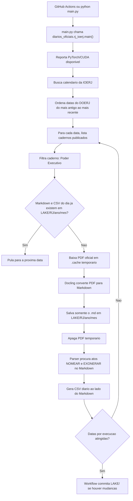

# Exoneracoes e nomeacoes nos diarios oficiais

Este projeto busca criar uma base historica de atos de exoneracao e nomeacao publicados em diarios oficiais brasileiros. A primeira etapa foca no Governo do Estado do Rio de Janeiro, acompanhando o Diario Oficial do Estado do Rio de Janeiro (DOERJ/IOERJ) em ordem cronologica, da edicao online mais antiga disponivel no portal atual ate as publicacoes mais recentes.

## Objetivos

- Converter as edicoes oficiais para Markdown com Docling e preservar somente o `.md` em `LAKE/UF`.
- Identificar atos de `NOMEAR` e `EXONERAR`.
- Catalogar data, caderno, nome da pessoa, tipo do ato, cargo, orgao, trecho e URL de origem.
- Produzir CSVs auditaveis para analise jornalistica, historica e civica.
- Evoluir para outros estados mantendo a mesma estrutura de coleta e dados.

## Fonte inicial: Rio de Janeiro

A fonte inicial e o portal da Imprensa Oficial do Estado do Rio de Janeiro:

- Calendario de edicoes: <https://www.ioerj.com.br/portal/modules/conteudoonline/do_seleciona_data.php>
- O calendario online atual lista edicoes a partir de julho de 2005.
- O proprio portal informa atendimento separado para edicoes pre-2008, entao essas edicoes podem exigir outra estrategia de obtencao no futuro.

## Como usar

Instale as dependencias:

```powershell
python -m pip install -r requirements-cuda.txt
python -m pip install -r requirements.txt
```

Rode o coletor:

```powershell
python main.py
```

O `main.py` nao recebe argumentos. Ele esta pronto para GitHub Actions: procura as datas da IOERJ em ordem cronologica, encontra o primeiro caderno de Poder Executivo que ainda nao tem Markdown e CSV em `LAKE/RJ`, baixa o PDF apenas como arquivo temporario, converte com Docling, apaga o PDF e salva os artefatos do dia.

O padrao dos arquivos e:

```text
LAKE/UF/ano/mes/<sigla>_<caderno>_<data>.md
LAKE/UF/ano/mes/<sigla>_<caderno>_<data>.csv
```

Exemplo:

```text
LAKE/RJ/2026/04/DOERJ_PARTE_I_PODER_EXECUTIVO_2026-04-29.md
LAKE/RJ/2026/04/DOERJ_PARTE_I_PODER_EXECUTIVO_2026-04-29.csv
```

Se o `.md` da edicao ja existir no repositorio, o coletor usa esse arquivo diretamente e nao baixa nem converte o PDF de novo. O CSV tambem e diario, salvo ao lado do Markdown.

Por padrao, o Docling usa o texto embutido no PDF, sem OCR, para manter a coleta mais rapida. Para edicoes escaneadas, altere a constante `ENABLE_OCR` em `diarios_oficiais/rj_ioerj.py`.

## GitHub Actions

O workflow `.github/workflows/coletar-doerj.yml` roda `python main.py` manualmente (`workflow_dispatch`) ou todos os dias as 08:30 UTC. Ele usa runner `self-hosted`, porque os runners hospedados pelo GitHub nao expoem a sua GPU local. Se o job ficar em `Waiting for a runner to pick up this job`, o runner local ainda nao esta online, nao esta vinculado a este repositorio, ou esta sem o label `self-hosted`.

O projeto instala PyTorch antes do Docling usando o wheel CUDA `cu118`, que e o menor runtime CUDA compativel com as versoes atuais do Torch exigidas pelo Docling. CUDA 11.7 exato fica preso em Torch 2.0.1, que conflita com o Docling atual.

## Fluxo



## Estrutura do CSV

| Campo | Descricao |
| --- | --- |
| `estado` | Unidade federativa da fonte. |
| `diario` | Nome do diario oficial. |
| `data_publicacao` | Data da edicao. |
| `caderno` | Caderno/secao da edicao. |
| `tipo_ato` | `nomeacao` ou `exoneracao`. |
| `nome` | Nome extraido do ato. |
| `cargo` | Cargo ou funcao, quando detectado. |
| `orgao` | Orgao, quando detectado. |
| `trecho` | Trecho usado para justificar a extracao. |
| `fonte_url` | URL da pagina oficial consultada. |
| `arquivo_markdown` | Caminho do Markdown gerado pelo Docling. |

## Observacoes

O parser atual e heuristico. Ele foi feito para iniciar a coleta com rastreabilidade, nao para prometer 100% de precisao. A validacao humana, amostragens e testes com diferentes anos/cadernos devem guiar os proximos ajustes.

Proximos passos naturais:

- Ampliar testes com edicoes recentes do Poder Executivo.
- Separar atos coletivos de atos individuais.
- Melhorar extracao de cargo e orgao.
- Registrar metricas por edicao, como total de atos encontrados e paginas processadas.
- Criar conectores equivalentes para outros estados.
